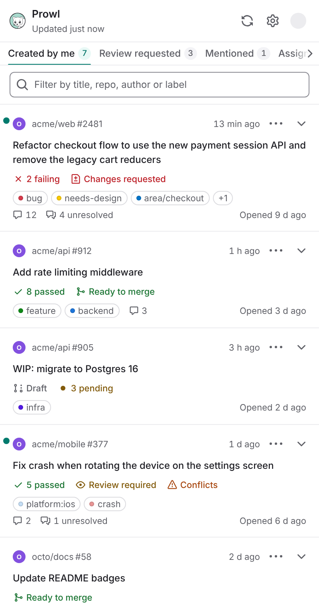

# Prowl

**Your GitHub pull requests, at a glance, in Chrome's side panel.**

Prowl shows the live state of the pull requests you care about (CI, reviews, conflicts, draft,
labels, activity), notifies you when something changes, and lets you act (approve, request
changes, comment, merge, re-run failed checks, toggle draft) without leaving the tab you are on.

100% client-side: no backend, no telemetry, no third-party servers. Your token stays in your
browser and is only ever sent to GitHub.

<p align="center">
  
</p>

[Website](https://aemard.github.io/prowl/) ·
[Install guide](https://aemard.github.io/prowl/install/) ·
[Sign-in guide](https://aemard.github.io/prowl/auth/) ·
[Privacy](https://aemard.github.io/prowl/privacy/) ·
[Changelog](CHANGELOG.md)

[](https://scorecard.dev/viewer/?uri=github.com/aemard/prowl)

## Install (about 2 minutes)

1. Download `prowl-vX.Y.Z.zip` from the [latest release](https://github.com/aemard/prowl/releases/latest) and unzip it.
2. Open `chrome://extensions` and turn on **Developer mode** (top right).
3. Click **Load unpacked** and pick the unzipped folder.
4. Pin Prowl from the puzzle-piece menu, then click its icon to open the side panel.
5. Sign in: **Continue with GitHub**, or paste a token (see below).

Requires Chrome 116 or later. Each release also ships an SBOM and a build provenance
attestation, and rebuilds byte for byte: see [verify a release](docs/releasing.md#verify-a-release).

## Sign in

| Way | What you need | CI status |
|---|---|---|
| Continue with GitHub | One click (device flow; available when the build has an OAuth client id) | Yes |
| Classic token | [Create one with the `repo` and `read:org` scopes](https://github.com/settings/tokens/new?scopes=repo,read:org&description=Prowl) | Yes |
| Fine-grained token | Pull requests, Contents, Actions (read and write), Commit statuses and Metadata (read) | Can be missing |

Fine-grained tokens cannot read check runs (GitHub only grants the Checks permission to Apps), so
CI status may be missing with them. Details: [sign-in guide](docs/auth.md).

## Features

- **Scope**: PRs you authored by default; add review requested (from you), team reviews
  (requests to your teams, found with `read:org`), mentioned, assigned, custom GitHub
  searches, and repository include/exclude filters. Each scope sits in a bar at the bottom of
  the panel, with its count. PRs with no
  commit for 20 days (you choose) step aside behind a "Show hidden" button and still notify;
  so can drafts and PRs opened by bots (Dependabot, Renovate), one switch each in Settings.
  A further switch groups each tab's PRs under their repository, in collapsible groups.
- **State on every card**: CI rollup, review decision, mergeable or conflicts, draft, labels,
  unresolved threads, comments, last activity and age. Expand a card for failing checks,
  reviewers and what blocks the merge.
- **Notifications**: CI failed, CI passed after a failure, new review, approved, changes
  requested, new comment, ready to merge, merged or closed by someone else, with Open and
  Snooze 1 h buttons. Per-event toggles, quiet hours, and a toolbar badge counting PRs that
  need you.
- **Actions**: approve, request changes and merge (with confirmation; only the merge methods the
  repository allows), turn auto-merge on or off, update a branch that is behind (merge or
  rebase), comment, re-run failed checks, ready for review / convert to draft, snooze, mute,
  open in GitHub, copy branch name.
- **Everywhere you work**: Ctrl+Shift+P (⌘⇧P on Mac) opens the panel (change it at
  chrome://extensions/shortcuts). Turn on settings sync to find your settings in Chrome on your
  other computers; the token and your local PR state never leave the device.
- **Polite polling**: every 5 minutes by default (2 minutes minimum), rate-limit aware, with
  backoff on errors. Light and dark themes, full keyboard support.

## Privacy

**Prowl cannot see or change the pages you visit: it has no access to your tabs or their
content.** Chrome enforces that through the extension's permissions, and a test fails the build if
they ever grow. Prowl only talks to `api.github.com` (and `github.com` for the optional
device-flow sign-in). Settings, the token and the PR snapshot live in `chrome.storage.local`;
snoozes and mutes never leave your machine. See the [privacy policy](docs/privacy.md).

| Permission | What it allows | Chrome's install prompt |
|---|---|---|
| `sidePanel` | Show Prowl in the side panel | Nothing |
| `storage` | Keep settings and data on your device | Nothing |
| `alarms` | Check GitHub on a schedule | Nothing |
| `notifications` | Tell you when a pull request changes | "Display notifications" |
| `api.github.com` | Read your pull requests and act on them, with your token | "Read and change your data on api.github.com" |
| `github.com` (optional) | Sign in with GitHub; asked for only then, and given back | Nothing at install |

Prowl can never read, inject code into or change a page, list your tabs or history, see other
sites' requests or cookies, or be driven by a web page: it has none of the permissions for that
([what it can never do](docs/privacy.md#what-prowl-can-never-do)).

## Development

```sh
pnpm install
pnpm verify        # Biome, types, unit tests + coverage gates, build, site, size budget, E2E
pnpm build         # production build in dist/ (load it unpacked)
pnpm dev           # rebuild dist/ on change
pnpm e2e           # Playwright against the real extension and a mock GitHub
pnpm screenshots   # same, and refresh docs/screenshots/ (at 2x)
pnpm zip           # prowl-v<version>.zip from dist/
```

Node 24+ (`.nvmrc`) and pnpm 12 (`packageManager`; pnpm downloads that exact version). E2E tests
never touch the real GitHub: they load `dist-e2e/` into Chromium and point it at a local mock
server (`tests/e2e/mock-github`).

| Path | What |
|---|---|
| `src/background/` | Service worker: polling, notifications, badge |
| `src/sidepanel/` | Preact UI (views, components, design system in `components/ui/`) |
| `src/lib/` | Pure logic: GitHub client and queries, diff engine, storage, time |
| `site/` | Astro website deployed to GitHub Pages |
| `docs/` | Architecture, decisions, design, security, auth, releasing |

Start with [`docs/architecture.md`](docs/architecture.md) and
[`CONTRIBUTING.md`](CONTRIBUTING.md). Security issues: see [`SECURITY.md`](SECURITY.md).

## License

[MIT](LICENSE)
