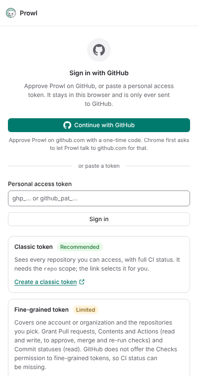
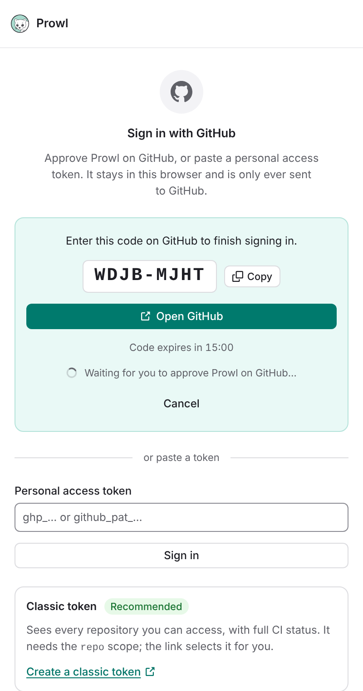

# Signing in to Prowl

Prowl talks to GitHub with a token that stays in your browser (`chrome.storage.local`) and is
only ever sent to GitHub. There are two ways to get one: approve Prowl on GitHub, or paste a
personal access token (PAT). Both end the same way: Prowl checks the token, shows who you are
and starts following your pull requests.

## Which way should I sign in?

| Way to sign in | Access | CI status |
|---|---|---|
| Continue with GitHub | Every repository you can access | Yes |
| Classic token | Every repository you can access | Yes |
| Fine-grained token | One account or organization, and the repositories you pick | Can be missing |

Pick **Continue with GitHub** when the button is there: there is nothing to copy, and the token
is created for you. Otherwise pick a **classic token**. Choose a fine-grained token only when you
want to limit Prowl to a few repositories and can live without CI status.

## Continue with GitHub

This signs in with an OAuth App through GitHub's device flow, the same way the GitHub CLI does.

1. Choose **Continue with GitHub** in the side panel.
2. Chrome asks to let Prowl access `github.com`. Prowl needs it to ask GitHub for a code and to
   learn that you approved it. Nothing else on `github.com` is read. If you decline, Prowl says
   so and you can still use a token.
3. Prowl shows a code such as `WDJB-MJHT` and opens `github.com/login/device`. Type the code
   there and approve **Prowl** for the `repo` scope.
4. Prowl notices the approval within a few seconds and signs you in. The code is valid for 15
   minutes, and the panel counts down. Cancel any time, or start again after it expired.

The sign-in only runs while the side panel is open. The `repo` scope is what GitHub requires to
read private repositories and to approve, merge and re-run checks.

### Not available in this build

Signing in from the browser needs an OAuth App client id built into the extension. Builds without
one (a fork, a local build, or a release made before the id was set up) show "Signing in from the
browser is not available in this build" and a link to this page. Use a token instead, or make
your own client id:

1. On GitHub, open Settings, Developer settings, OAuth Apps, and choose **New OAuth App**. The
   callback URL is not used; any URL works.
2. Tick **Enable Device Flow** on the app's page.
3. Build with `PROWL_GITHUB_CLIENT_ID=<your client id> pnpm build`. The id is public. Prowl never
   uses a client secret.

If your organization restricts third-party OAuth Apps, an owner has to approve Prowl first (or
you use a token).

## Sign in with a token

Paste a token into the field on the same screen. The panel links to GitHub's token pages with the
form filled in.

### Classic token (recommended)

1. Open [github.com/settings/tokens/new](https://github.com/settings/tokens/new?scopes=repo&description=Prowl)
   (Settings, Developer settings, Personal access tokens, Tokens (classic), Generate new token).
2. Name it, choose an expiry and tick **`repo`**. Nothing else is needed.
3. Select **Generate token**, copy it (it starts with `ghp_`) and paste it into Prowl.

`repo` lets Prowl read private repositories, read CI status, and approve, merge and re-run
checks. To follow public repositories only, `public_repo` is enough. A classic token without
`repo` still signs in, but it only sees public repositories, and Prowl warns you.

If your organization uses SAML single sign-on, select **Configure SSO** next to the token on
GitHub and authorize it for the organization, or its repositories will be missing.

### Fine-grained token

1. Open [Generate a fine-grained token](https://github.com/settings/personal-access-tokens/new?name=Prowl&description=Prowl+side+panel&pull_requests=write&contents=write&actions=write&statuses=read).
   The link fills in the permissions below.
2. Choose one **resource owner** (your account, or one organization) and the repositories to
   include.
3. Under **Repository permissions**, grant:
   - **Pull requests**: read and write (approve, request changes, comment, toggle draft)
   - **Contents**: read and write (merge)
   - **Actions**: read and write (re-run failed jobs)
   - **Commit statuses**: read (CI status from commit statuses)
   - **Metadata**: read (GitHub always grants it)
4. Generate the token (it starts with `github_pat_`), copy it and paste it into Prowl.

Reading is enough to follow pull requests: **Pull requests** (read) and **Commit statuses**
(read). Without the write permissions, the action buttons fail with a message from GitHub.

Fine-grained tokens have two limits Prowl cannot work around:

- **CI status can be missing.** GitHub has no Checks permission for fine-grained tokens, so
  check runs from GitHub Actions and other apps may be missing from a pull request. Legacy
  commit statuses still work. Prowl tells you this after signing in.
- **One owner per token.** A token covers a single user or organization. To follow several, use
  a classic token. Repositories you only collaborate on from outside an organization are not
  covered either.

## If something goes wrong

- **"GitHub rejected this token"**: the token was copied incompletely, has expired or was
  revoked. Create a new one.
- **"That does not look like a GitHub token"**: remove spaces and quotes around it.
- **"GitHub refused this token"**: usually SAML single sign-on or an organization policy.
  Authorize the token for the organization (classic) or ask an owner to approve it.
- **A private repository is missing**: the token has no `repo` scope, or it is not authorized
  for that organization.
- **No CI status on a pull request**: you use a fine-grained token (see above).
- **"Could not reach GitHub"**: check your connection, then try again.

## Signing out and revoking access

Sign out from the account menu in the panel. Prowl removes the token and the fetched data from
your browser, but it does not revoke the token at GitHub. To end Prowl's access completely:

- For **Continue with GitHub**: GitHub, Settings, Applications, Authorized OAuth Apps, then
  revoke Prowl.
- For a **token**: GitHub, Settings, Developer settings, Personal access tokens, then delete it.
